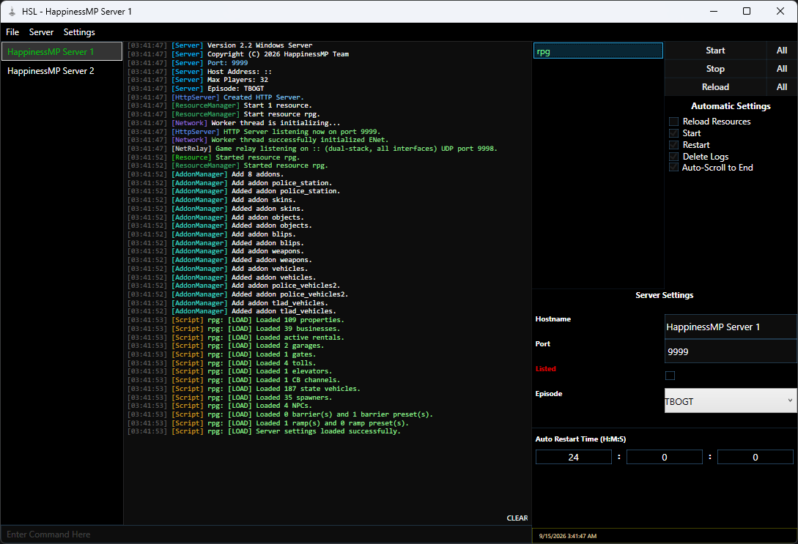

# HSL

HSL is a Windows launcher and manager for [HappinessMP](https://happinessmp.net/) servers.

This project is a fork of [ProjectHMP/HSL](https://github.com/ProjectHMP/HSL). It keeps the original HSL functionality while adding a few UI/UX improvements and additional features.



## Features

### Original HSL features

- Create new servers, add existing servers, and update server installations.
- Start, stop, and restart servers.
- Manage multiple servers from one launcher window.
- Edit server settings from the launcher.
- Start, stop, and reload resources individually or all at once.
- Start servers automatically and restart them after a crash or on a schedule.
- Delete old server logs, including backups, when a server starts.
- Delete a server's cache.
- Display and interact with the server console.

### Changes in this fork

- Optional auto-scrolling to the end of the live server console.
- A custom icon for the application executable.
- Support for the current `resstart`, `resstop`, and `resrestart` resource commands.
- Color-coded console output for server categories and common log severity tags.
- Improved contrast for disabled controls and clearer resource selection in the UI.
- A configurable global hotkey for reloading all resources, using `F17` by default.
- The launcher remembers its window size between sessions.
- Resource state and automatic resource reloads are kept in sync more reliably as resource files change.

## Download

Releases will be published through the repository's [GitHub Releases](../../releases) page.

The application is published as a self-contained, single-file Windows x64 executable.

## Requirements

The project targets .NET Core 3.1. Install the [.NET Core 3.1 runtime and SDK](https://dotnet.microsoft.com/en-us/download/dotnet/3.1) if the application does not start or you want to build it locally.

## Build

Clone the repository, open `HSL.sln` in Visual Studio, or build it from the repository root with the .NET CLI:

```batch
dotnet build HSL.sln
dotnet publish HSL/HSL.csproj -c Release -r win-x64
```

## Contributing

Pull requests are welcome. If you are changing server lifecycle or resource handling, please explain how you tested the change with a HappinessMP server.

## License and upstream

This fork is released under the [MIT License](LICENSE). ProjectHMP's original HSL repository is also MIT-licensed.
